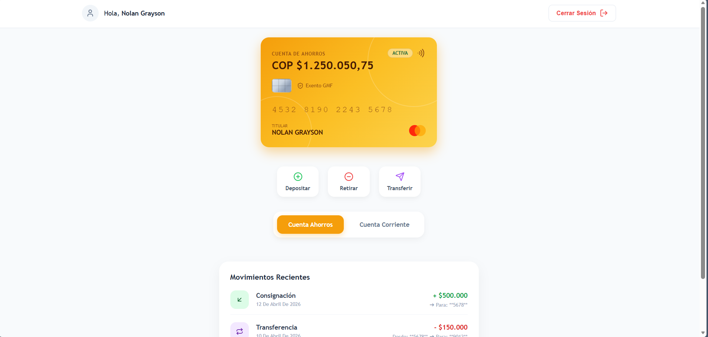

## Frontend - Presentación Trabajo Dockerización
Este repositorio corresponde al **frontend** desarrollado para la presentación del trabajo de **Dockerización de Aplicaciones** en la asignatura **Ingeniería de Software Orientada a Objetos**.  
Hace uso del repositorio backend de la prueba técnica hecha por Kadanarpa, integrante del grupo: [Trinity-Financial-App](https://github.com/kadanarpaOps/Trinity-Financial-App).

### Preview

  

